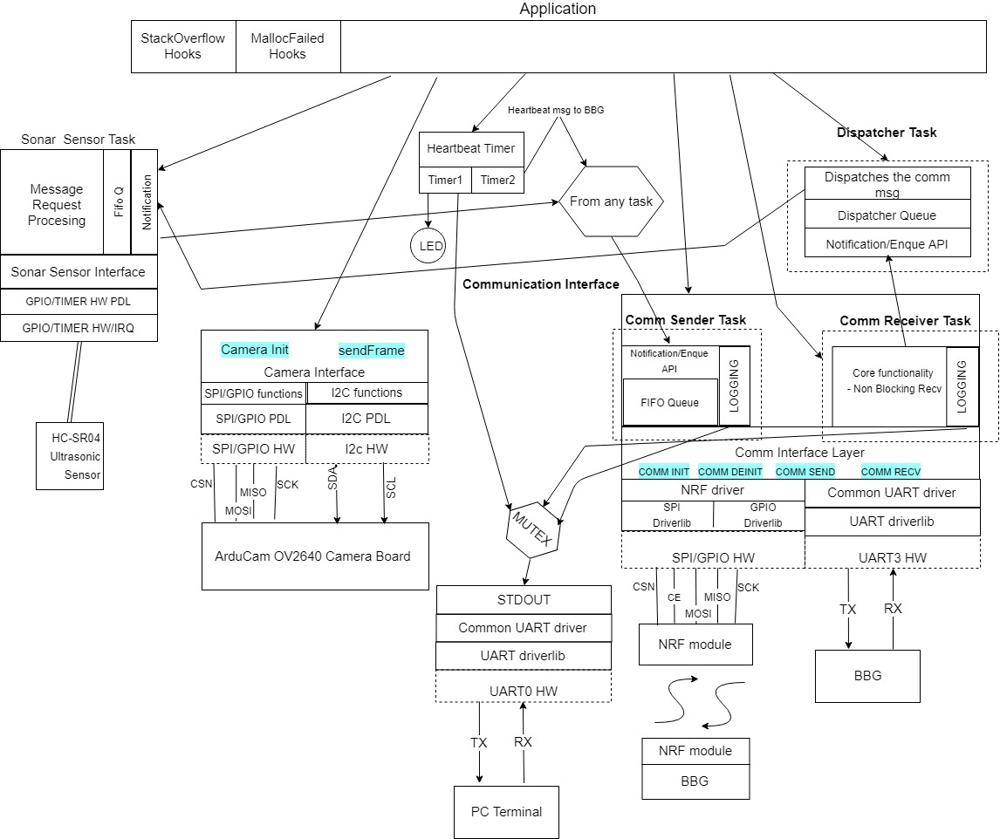
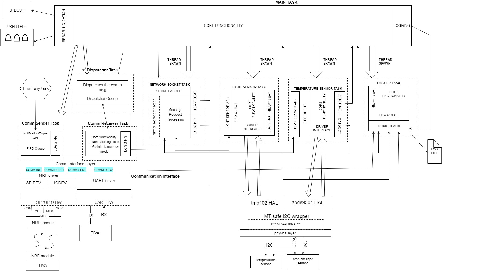

# ECEN5013 Project 2
## Author - Gunj Manseta (Embedded Systems Engineering - University of Colorado Boulder)
### Features: 
- Proximity camera capture device  
- Captures image if the object found to be at a specific distance from the sensor  
- The image frame captured, gets stored on the server – BeagleBoneGreen  
- Remote Logging  
- Remote Client – Connects to the BBG via sockets to get the sensor values, and close the server.  
- Communication of the Client(TIVA) to Server(BBG) via compile-time swappable UART(tested) or RF layer  
- Detailed Messaging structure to handle communication among multiple modules(threads/sfotware components) running on multiple boards

### Hardware components:   
#### TIVA C series TM4C1294XL development board running FreeRTOS  
- HC-SR04 Ultrasonic Sensor (GPIO and Timers)  
- Arducam OV2640 2MP camera module (SPI/GPIO/I2C)  
- NRF24L01(+) (SPI/GPIO)  

#### BeagleBone Green  running Debian distro Linux  
- TMP102 temperature sensor (I2C)  
- APDS9301 luminosity sensor (I2C)  
- NRF24L01(+) (SPI/GPIO)    

### Software Components:
#### Tiva+FreeRTOS
- Sensor tasks  
- Communication Module tasks – Comm recv, Comm Send, Dispatcher  
- Heartbeat timer  
- Camera Interface    
- Sonar Sensor interface  
- Driverlib  
- Messaging Queues, Task Notifications, and Mutexes  

#### BBG+Linux
- Sensor tasks  
- Communication Module tasks – Comm recv, Comm Send, Dispatcher  
- Heartbeat  
- Socket Server for remote access of on-board and Tiva sensor, and to close the application  
- Logging task  
- HW drivers  
- Messaging Queues, and Mutexes  

### Messaging structure:
```
COMM_MSG -  
    /* Transport Layer Start */
    SRC_ID src_id;
    SRC_BOARD_ID src_brd_id;
    DST_ID dst_id;
    DST_BOARD_ID dst_brd_id;
    /* Transport Layer End */
    /* Message Layer Start */  
    MSG_ID msg_id;
    union custom_data {
        float distance_cm;
        float sensor_value; 
    } data;
    char message[18];
    /* Message Layer End */
    /* Message authentication */  
    uint16_t checksum;
```

### Software Architecture Diagram:
#### TIVA + FreeRTOS

#### BBG + Linux



#### Code Documentation can be found at - [Project Code Documentation webpage](http://htmlpreview.github.io/?https://github.com/mansetagunj/ECEN-5013/blob/master/Project2/BBG/documentation/doxygenfiles.d/html/index.html "Documentation WebPage") (Ctrl+click for new tab)
